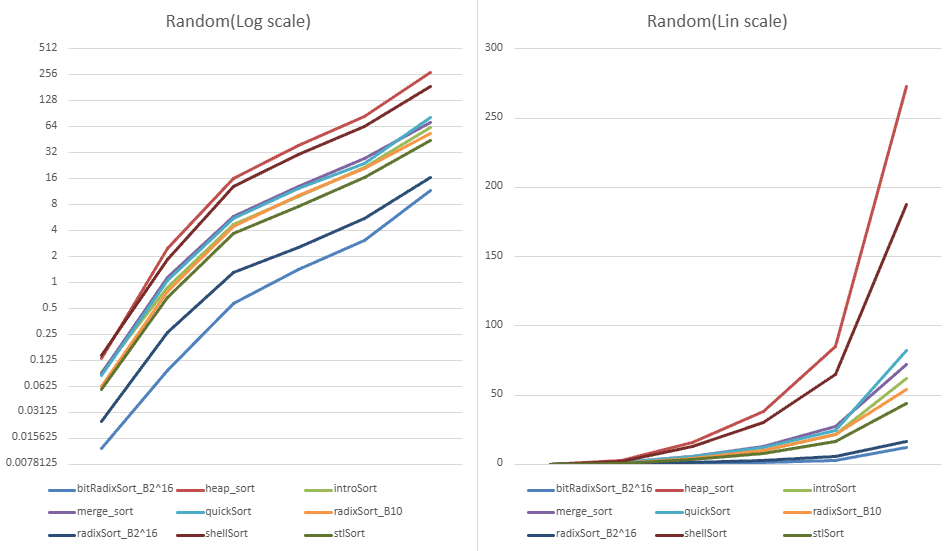
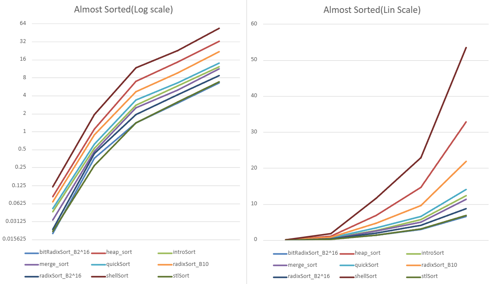
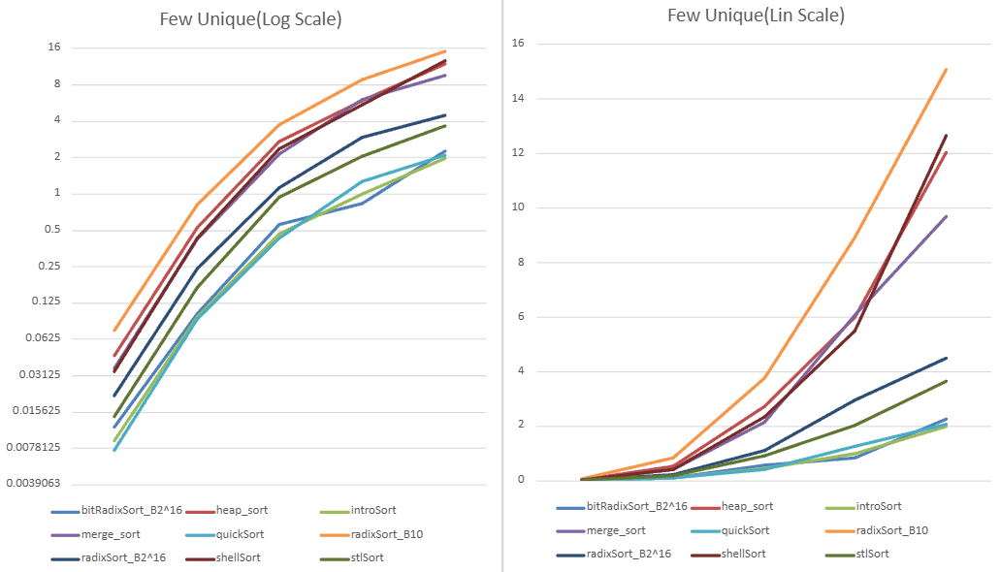
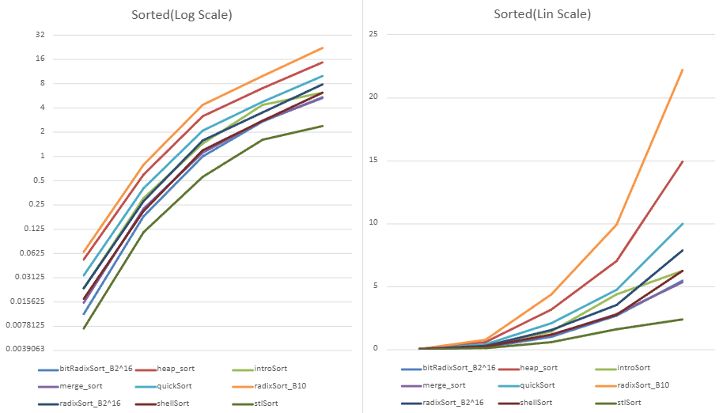
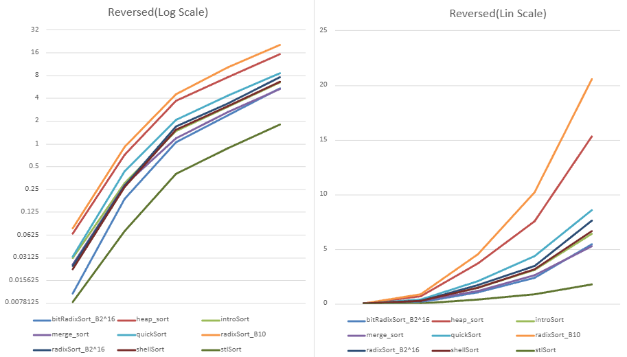

# Data Structure Sorting project

| Algorithm  | Avg Time           | Worst Time       | Space auxiliary | Stable |
|------------|--------------------|------------------|-----------------|--------|
| Radix Sort | O(n+k)             | O(n+k)           | O(n+k)          | Yes    |
| Heap Sort  | O(n log n)         | O(n log n)       | O(1)            |        |
| Intro Sort | O(n log n)         | O(n log n)       | O(1)            |        |
| Merge Sort | O(n log n)         | O(n log n)       | O(n)            | Yes    |
| Quick Sort | O(n log n)         | O(n2) | O(n)            | Yes    |
| Shell Sort | O(n1.5) | O(n2) | O(1)            |        |
| Stl Sort   | O(n log n)         | O(n log n)       | O(1)            |        |

## We used 5 types of lists
1. random (numbers are random)
2. Almost Sorted(10% of numbers are in the worng position)
3. few Uniques (are only 5 unique numbers)
4. sorted(numbers are sorted)
5. reversed(numbers are sorted in reverse order)

### Random (used as a base)

1. bit Radix Sort 2^16
2. Radix Sort 2^16
3. stl Sort
4. Radix Sort B10
5. intro Sort
6. merge Sort
7. quick Sort
8. Shell Sort
9. Heap Sort

### Almost Sorted

1. bit Radix Sort 2^16
2. stl Sort
3. radix sort 2^16
4. merge sort
5. intro sort
6. quick sort
7. radix sort b 10
8. heap sort
9. shell sort

### Few Unique

1. Intro Sort
2. quick Sort
3. bit Radix Sort 2^16
4. stl Sort
5. radix Sort 2^16
6. merge Sort
7. heap Sort
8. shell Sort
9. radix Sort B10

### Sorted

1. Stl Sort
2. merge Sort
3. Bit Radix Sort 2^16
4. shell Sort
5. intro Sort
6. Radix Sort 2^16 
7. quick Sort
8. heap Sort
9. Radix Sort B10

### Reversed

1. Stl Sort
2. bit radix Sort 2^16
3. merge Sort
4. intro Sort
5. shell Sort
6. Radix sort 2^16
7. quick sort
8. heap sort
9. Bit Radix sort 10

## Conclusions:
#### Stl Sort
- Is good overall
- Likely benefits from being highly optimized in C++
#### Radix Sort 
- Very good with a big base and a power of 2 base 
- Best on Random and Almost sorted data (on almost sorted data has very good cache locality)
#### Merge Sort
- good overall, excells on almost sorted values
#### Quick Sort
- Perform very good in partialy sorted data or few uniques numbers
- is very good on few uniques number because it paritionate in 3 groups the numbers and it tends to be O(n)
#### Intro Sort
- A pretty good optimisation of Quick Sort having a 10-15% better performance
#### Heap Sort
- Pretty bad overall because of bad cache locality
#### Shell Sort
- Generally not competitive with other sorts.
- Can be useful on small or partially sorted arrays.

