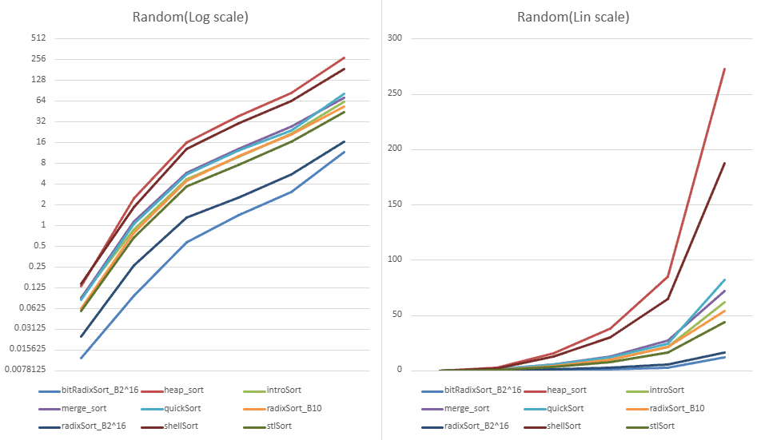
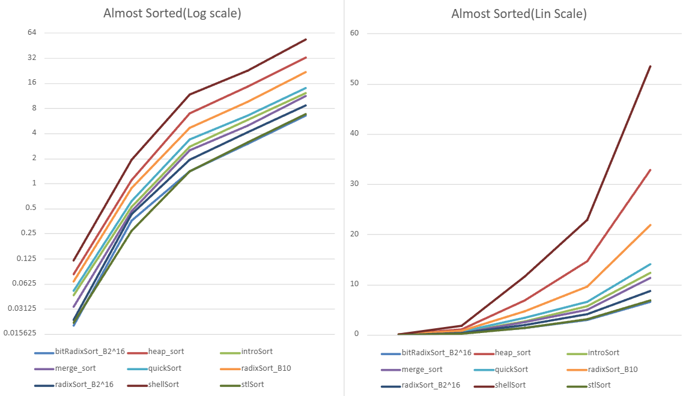
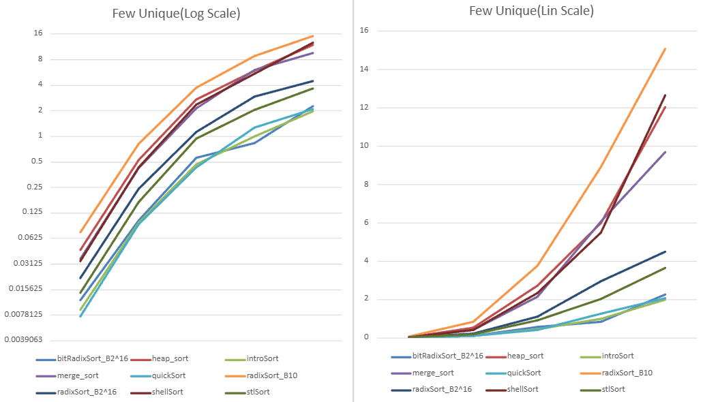

# Data Structure Sorting project

| Algorithm  | Avg Time            | Worst Time       | Space auxiliary |
|------------|---------------------|------------------|-----------------|
| Radix Sort | O(n+k)              | O(n+k)           | O(n+k)          |
| Heap Sort  | O(n log n)          | O(n log n)       | O(1)            |
| Intro Sort | O(n2)    | O(n2) | O(1)            |
| Merge Sort | O(n log n)          | O(n log n)       | O(n)            |
| Quick Sort | O(n log n)          | O(n2) | O(n)            |
| Shell Sort | O(n1.5)  | O(n2/sup>)  | O(1)            |
| Stl Sort   | O(n log n)          | O(n log n)       | O(1)            |

## We used 5 types of lists
random (numbers are random)
Almost Sorted(10% of numbers are in the worng position)
few Uniques (are only 5 unique numbers)
sorted(numbers are sorted)
reversed(numbers are sorted in reverse order)

### Random (used as a base)

1. bit Radix Sort 2^16
2. Radix Sort 2^16
3. stl Sort
4. Radix Sort B10
5. intro Sort
6. merge Sort
7. quick Sort
8. Shell Sort
9. Heap Sort

### Almost Sorted

1. bit Radix Sort 2^16
2. stl Sort
3. radix sort 2^16
4. merge sort
5. intro sort
6. quick sort
7. radix sort b 10
8. heap sort
9. shell sort

### Few Unique

